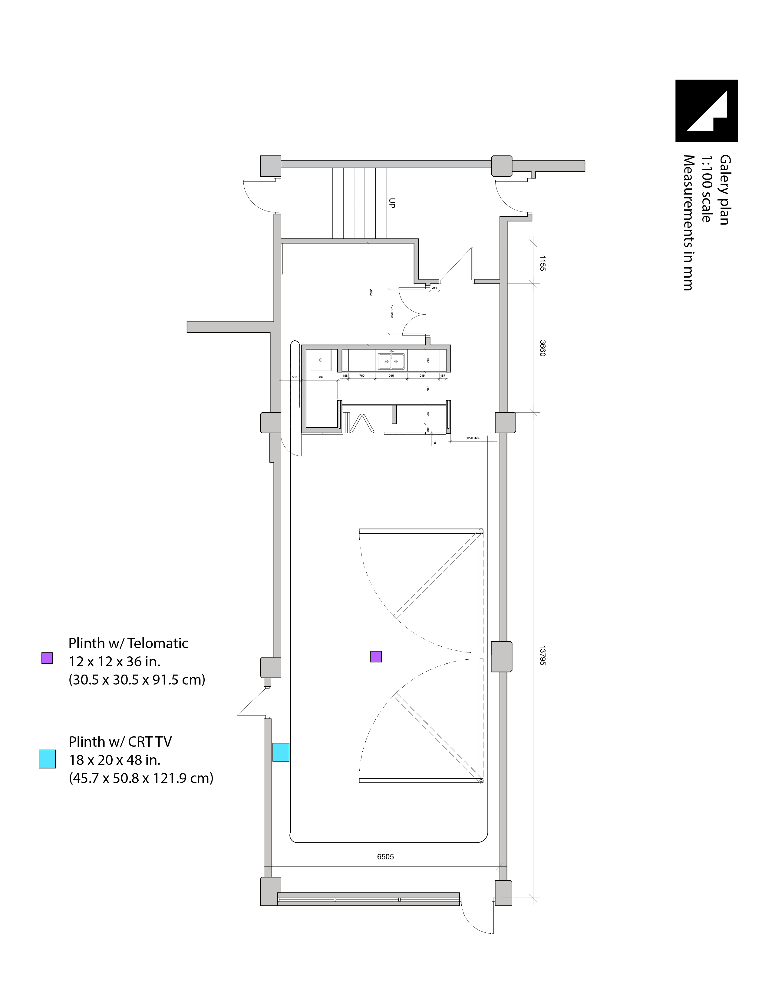

# Telomatic
## [Online](https://hybrid.concordia.ca/i_planch/telomatic/)
## [Gallery](https://hybrid.concordia.ca/i_planch/telomatic/gallery/)

## Artist Statement
*Telomatic* is an exploration of post-digital intersubjectivity through sculptural and computational electronic art.   
Drawing inspiration from telematic art, technology ethics and cypherpunk ideas, this project seeks to comment on and propose playfully engaging alternatives to the dematerialization of contemporary virtualized landscapes as well as address concerns of cybersecurity in our increasingly connected age. From an immediate socio-cultural standpoint, *Telomatic* is inspired by the rise of teledildonics, a phenomenon encompassing both the creation and advertisement (both commercial and DIY) of connected sex-toys, and consequent ethical questions concerning the use, abuse and cybersecurity of such objects (cryptodildonics), theorized by researchers such as Sarah Jamie Lewis. Artistically, this piece follows in the footsteps of early telematic art, such as Heath Bunting’s 1994 King’s Cross Phone-In, which brought interactivity to the cybernetic realm and favoured a conceptually playful critical reading of technological progress. Within this broad world, Telomatic is specifically inspired by artists pushing the limits of corporeal cyberart, such as Marcel·lí Antúnez Roca, ORLAN and Stelarc, whose work points to the amplifying effect of embodied materiality on telematic interactivity.   
In theory, *Telomatic* is an interactive experience reverse-engineering embodied possibilities of telematic experience. In practice, it presents as a silicone-cast telehaptic anal plug actuated by online interaction. The viewer initially engages with the piece through an apparently innocuous web application proposing an augmented reality drawing activity using machine-learning trained real-time hand pose detection (The Apparatus). The data generated by this activity also serves, via a wireless connection, to vibrate the plug (The Exparatus). The Apparatus and Exparatus are spatially segregated so that the viewer only later understands the relationship between the initial ludic action and its telematic consequences.
## [R&D](https://docs.google.com/document/d/171jCMU2Uvftuaj1wQvpLnJiblMUfXRC_yw7K845iRvM/edit#)
### [Technical requirements](https://docs.google.com/spreadsheets/d/1EiCkT_d4SfhvJUTGcMUOAlP5tgtxAsZL5qKjLGzvXDs/edit#gid=1403493750)
### Installation diagram
.png)
### Installation footprint

