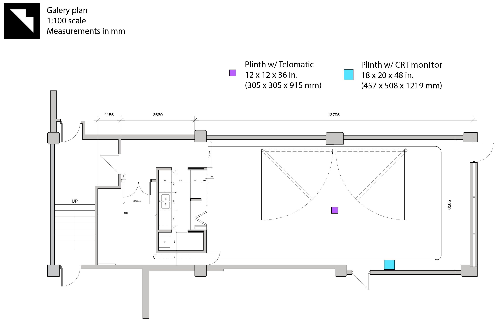

# Telomatic
*Telomatic* is an exploration of post-digital intersubjectivity through electronic, sculptural and computational art.   
Drawing inspiration from telematic art, technology ethics and cypherpunk ideas, this project seeks to comment on and propose playfully engaging alternatives to the dematerialization of contemporary virtualized landscapes while addressing concerns of cybersecurity in our increasingly connected age.   
  
From an immediate socio-cultural standpoint, *Telomatic* is inspired by the rise of teledildonics, a phenomenon encompassing both the [creation]( http://dildo-generator.com/) and [advertisement](https://www.reddit.com/r/ToyControl/) (both commercial and DIY) of connected sex-toys, and consequent ethical questions concerning the [use](https://buttplug.io/), [abuse](https://www.bbc.com/news/technology-54436575) and [cybersecurity](https://www.wired.co.uk/article/sex-toy-bluetooth-hacks-security-fix) of such objects (cryptodildonics), theorized by researchers such as [Sarah Jamie Lewis](https://dl.acm.org/doi/10.1145/3139937.3139942).   
Artistically, this piece follows in the footsteps of early telematic art, such as Heath Bunting’s 1994 King’s Cross Phone-In, which brought interactivity to the cybernetic realm and favoured a conceptually playful critical reading of technological progress. Within this broad world, *Telomatic* is specifically inspired by artists pushing the limits of corporeal cyberart, such as Marcel·lí Antúnez Roca, ORLAN and Stelarc, whose work (e.g. [Epizoo](doc/doc_epk/doc_epk_epizoo.jpeg), [Ping Body](doc/doc_epk/doc_epk_pingbody.jpg)) points to the amplifying effect of embodied materiality on telematic interactivity.   
   
In theory, *Telomatic* is an interactive experience reverse-engineering embodied possibilities of telematic experience via subverted teledildonics. In practice, it presents as a silicone-cast anal plug actuated by online interaction.   
   
The viewer initially engages with the piece through an apparently innocuous web application proposing an augmented reality drawing activity using machine-learning trained real-time hand pose detection (The Apparatus). The data generated by this activity also serves, via a wireless connection, to vibrate the plug (The Exparatus). The Apparatus and Exparatus are spatially segregated so that the viewer only later understands the relationship between the initial ludic action and its telematic consequences.  
   
Using their right index finger, the viewer traces a line of which the weight and colour can be modulated with the left index finger. This digital finger-painting canvas is superposed on the webcam video feed. 
A screenshot of the drawing, which is uploaded to a gallery and echoed back to the viewer as a scannable QR code. The gallery of drawings creates a collage that can be used as a meta-canvas for a random *cadavre exquis* or an intentional *générateur poïétique*.  
Technically, the application rests on a structure of HTML & CSS, is scripted in Javascript & PHP, and implements [p5.js](https://p5js.org/), [jQuery](https://jquery.com/) for DOM manipulations, [jQueryUI](https://jqueryui.com/) for GUI element generation, [MediaPipe Hands](https://google.github.io/mediapipe/solutions/hands.html) for hand position detection and [QRCode.js](https://github.com/davidshimjs/qrcodejs) for QR code generation and formatting. 
A few elements (e.g. PHP scripting and server implementation) were achieved with extensive help from Sabine Rosenberg.

<!-- ## [Online](https://hybrid.concordia.ca/i_planch/telomatic/) -->
## [Demo](https://ylliez.github.io/telomatic/web/)
## [Gallery](https://hybrid.concordia.ca/i_planch/telomatic/gallery/)

## [Documentation](doc/)
## [R&D](https://docs.google.com/document/d/171jCMU2Uvftuaj1wQvpLnJiblMUfXRC_yw7K845iRvM/edit#)
## [Technical requirements](https://docs.google.com/spreadsheets/d/1EiCkT_d4SfhvJUTGcMUOAlP5tgtxAsZL5qKjLGzvXDs/edit#gid=1403493750)
### Installation diagram

### Installation footprint

